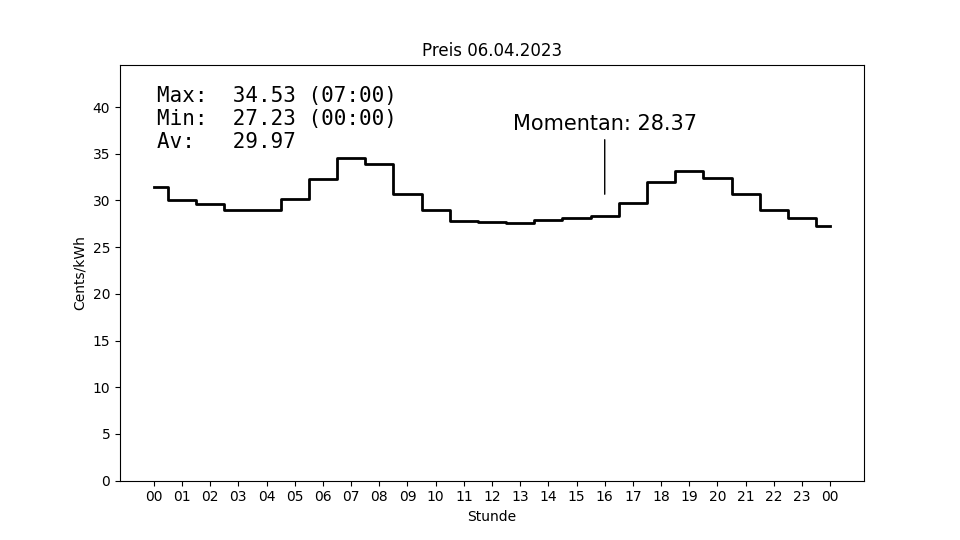

# entsoEchartmaker
Re-create the Tibber Price Chart for ePaper Display. 

This little project aims to re-create the Tibber price chart instead of scraping it from their website. Final result is a container running the script which creates the price chart. The chart in turn will be served to clients by a web server.

## Why? 
The scraped chart is pretty hard to read. So we'd love to have a more legible display. 

## How? 
Tibber pricing is based off european spot market prices. There's additional cost per kWh caused by transmission fees and some german peculiarities. We need to add these to the spot market price reported to/by ENTSO-E.

## Problems along the way? 
Good luck finding the levies and/or transmission fees you need to add to the raw spot market price. Even then, the result probably won't match the price chart on Tibber's website. That's not a problem, though. Tibber don't know the exact amount of fees/levies themselves and will only be told by your local utility once you've become a customer.

## Result
This is how the chart looks like with raw spot market pricing (DST Switch):

This is how a line render of the pricing data looks like with VAT and additional pricing components included:

# German Electricity Pricing Components
We'll start from sport market pricing.  
On top of that, there's
- a concession fee per kWh (given VAT incl. / excl. depending on provider). Municipalities want money for transmission lines run on their territory (Konzession).
- a general fee per kWh for the benefit of the local utility (given VAT incl. / excl.) (Netzgebühr).
- electricity tax per kWh (VAT excl.). Federal government wants money for electricity consumption (Elektrizitätssteuer).
- levies (VAT excl.). Someone has to pay for wtf (KWKG-Umlage, § 19 StromNEV-Umlage, Offshore-Umlage).

Finally, Tibber will add a fixed amount of procurement cost per kWh.

That's electricity pricing only. Additionally, there's a fee for metering point operation. We don't take that into account.

TF, trying to calculate my price.

Pretty much impossible to to. How on earth is any normal person supposed to calculate their resulting price if
- the local utility has parts of these price components strewn all over their website without a single, comprehensive chart
- my current provider (using the local utility for the last mile) shows different re-imbursements to the local utility from what the local utility has on their website
- the levies for offshore and whateverthefuckelse differ from what federal regulations say?
- Tibber do not give details on their price calculation for any given Zip code.

The only thing cosistently given is electricity tax. Well, at least I found out why Tibber don't give price calculation details. 

Let's try Hamburg:
All without VAT, 2023 Pricing:
- General Fee 8,92 Cent/kWh
- Concession: 2,39 Cent/kWh
- Levies:
  - KWKG: 0,357 Cent/kWh (https://www.netztransparenz.de/KWKG/KWKG-Umlagen-Uebersicht)
  - Offshore: 0,591 Cent/kWh (https://www.netztransparenz.de/EnWG/Offshore-Netzumlage/Offshore-Netzumlagen-Uebersicht)
  - Cosumer Fee: 0,417 Cent/kWh (https://www.netztransparenz.de/EnWG/-19-StromNEV-Umlage/-19-StromNEV-Umlagen-Uebersicht)
- Electricity Tax: 2,05 Cent/kWh  

Makes for 14,725 Cents/kWh (VAT excl)

Tibber adds another 0,9Cents / kWh (VAT excl) -> 15,645 Cent/kWh VAT excl.

Add 19% VAT (2,97225 Cents/kWh) -> 18,61755 Cent/kWh (VAT incl)  
Add 19% VAT for Spot Market Rate (9,6Cents/kWh x 0,19 = 1,824 Cent/kWh) -> 20,44155 cent/kWh.  

Guess what: Tibber gives us 20,19 Cent/kWh for taxes and fees.

TF.

After back and forth with some really friendly and helpful people from the Tibber helpline: They themselves only know the exact amount of fees and concession as soon as they have a contract with you. Only then, the local utility will let them know the current rates. So they do the best they can when you enter a ZIP code for a price estimate using averages based on their experience. 

TF, the German electricity market is just so broken. How about the Federal Regulator (Bundesnetzagentur) setting up a database? What the hell are these guys doing?

# Technical Deep Dive
## Choice of Container
There's three possibilities for the base image:
- Docker Official Python Image (based on various distros (Debian, Ubuntu, Alpine) and even Windows): https://hub.docker.com/_/python
- Distro Base Image with additional Python install per Dockerfile
- Distroless Python (https://github.com/GoogleContainerTools/distroless)

Now, what are my criteria?
- I'm lazy. The container will be running for quite a while without being re-created. So we'd like to make sure we can auto-update the container.
- I like it comfortable. Debug options should be included. 
- I have room to spare. While a smaller container would be nice, size is not the main criteria.

The result?
We'll use a distribution base image so we can run unattended upgrades for security fixes. If something breaks, it breaks. I'd rather have a broken container than a security problem (yes, problem). The base distro image will also include a shell for debug while being a bit larger.  
