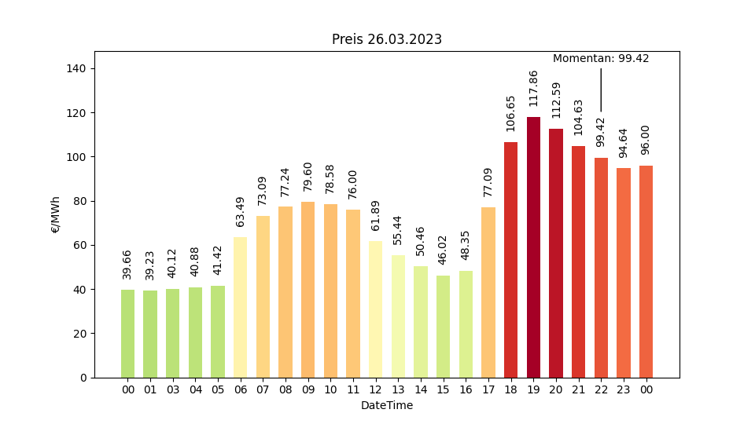

# entsoEchartmaker
Re-create the Tibber Price Chart for ePaper Display. 

This little project aims to re-create the Tibber price chart instead of scraping it from their website. 

Why? The scraped chart is pretty hard to read. So we'd love to have a more legible display. 

How? Tibber pricing is based off european spot market prices. There's additional cost per kWh caused by transmission fees and some german peculiarities. We need to add these to the spot market price reported to/by ENTSO-E.

This is how the chart looks like with raw spot market pricing (DST Switch):

# German Electricity Pricing Components
